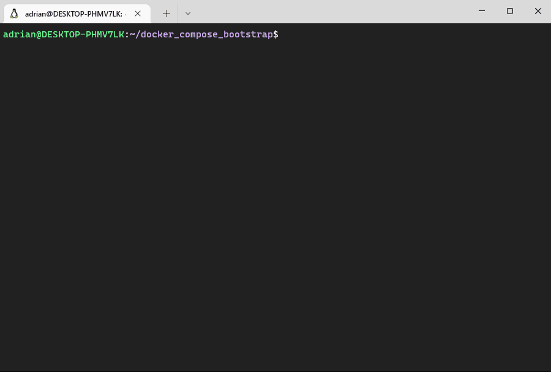
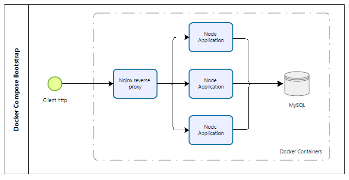

# Docker Compose Bootstrap - Random User Insertion

Bootstraps a Nginx-Node-MySql application with docker-compose

## DockerHub repository

[adrianpereira/random-user-insert-nginx-node](https://hub.docker.com/r/adrianpereira/random-user-insert-nginx-node)

[adrianpereira/random-user-insert-node-app-mysql](https://hub.docker.com/r/adrianpereira/random-user-insert-node-app-mysql)

The production tags of the repositories above was generated from the Dockerfiles located at ./sources


## Usage

To run this project execute the following command after installing docker

```bash
  docker-compose up
```

Demo:



* Every access to http://localhost:8080/ creates a new user with random name
* The data remains at /mysql after removing the containers


